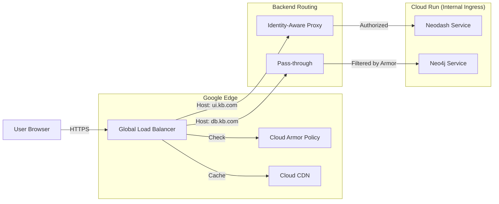

# Secure Edge Architecture: Strong CDN & Identity

## Goal
Establish a production-grade, "Zero Trust" perimeter for the Knowledge Base, utilizing Google Cloud's advanced networking and security services.

## Components

### 1. Global External HTTPS Load Balancer (GCLB)
- **Role**: The single public entry point (Anycast IP).
- **Function**: Terminates SSL (Managed Certificates), routes traffic to backend services based on hostname/path.
- **Benefit**: Google's global network backbone reduces latency (CDN effect) and hides origin servers.

### 2. Cloud Armor (WAF & DDoS Protection)
- **Role**: "Cloudflare-like" security layer attached to the Load Balancer.
- **Policies**:
    - **DDoS Protection**: Automatically mitigates volumetric attacks.
    - **WAF**: Filters common web exploits (SQLi, XSS).
    - **Rate Limiting**: Throttles abusive IPs.
    - **Geo-Blocking**: Can restrict access to specific countries if needed.
- **Deployment**: Applied to the `neo4j` backend service to protect the database port.

### 3. Identity-Aware Proxy (IAP)
- **Role**: Google Workspace OAuth Authentication.
- **Function**: Intercepts requests to the Web UI (`Neodash`). Redirects unauthenticated users to Google Login.
- **Benefit**: **Zero VPN**. Only employees with valid Google Workspace accounts can access the dashboard.
- **Deployment**: Applied to the `neodash` backend service.

### 4. Cloud CDN
- **Role**: Edge Caching.
- **Function**: Caches static assets (JS, CSS, Images) from Neodash at Google's edge locations.
- **Benefit**: Faster UI load times globally.

## Traffic Flow Diagram

## Security Posture
- **Web UI**: Strictly internal-only access (via IAP). No public exposure.
- **Database (Neo4j)**: Publicly addressable (for browser connectivity) but hardened:
    - Protected by **Cloud Armor** (Rate limiting, IP reputation).
    - Protected by **Strong Password** (Neo4j native auth).
    - **TLS Encrypted** (Managed Certs).

## Requirements
- **Domain Name**: You need a domain (e.g., `kb.yourcompany.com`) to provision Managed SSL certificates.
- **OAuth Consent**: A generic "Internal" OAuth consent screen must be configured in GCP Console (cannot be fully automated via Terraform).
